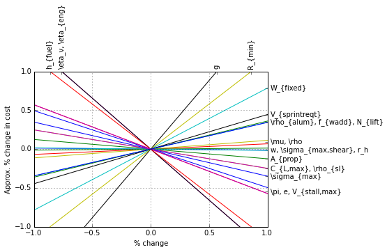

Advanced Commands
*****************

Feasibility Analysis
====================

If your Model doesn't solve, you can automatically find the nearest feasible version of it with the ``Model.feasibility()`` command, as shown below. The feasible version can either involve relaxing all constraints by the smallest number possible (that is, dividing the less-than side of every constraint by the same number), relaxing each constraint by its own number and minimizing the product of those numbers, or changing each constant by the smallest total percentage possible.

.. code-block:: python

    from gpkit import Variable, Model, NomialArray
    x = Variable("x")
    x_min = Variable("x_min", 2)
    x_max = Variable("x_max", 1)
    m = Model(x, [x <= x_max, x >= x_min])
    # m.solve()  # raises a RuntimeWarning!
    feas = m.feasibility()

    # USING OVERALL
    m.constraints = NomialArray(m.signomials)/feas["overall"]
    m.solve()

    # USING CONSTRAINTS
    m = Model(x, [x <= x_max, x >= x_min])
    m.constraints = NomialArray(m.signomials)/feas["constraints"]
    m.solve()

    # USING CONSTANTS
    m = Model(x, [x <= x_max, x >= x_min])
    m.substitutions.update(feas["constants"])
    m.solve()

Plotting variable sensitivities
===============================

Sensitivities are a useful way to evaluate the tradeoffs in your model, as well as what aspects of the model are driving the solution and should be examined. To help with this, GPkit has an automatic sensitivity plotting function that can be accessed as follows:

.. code-block:: python

    from gpkit.interactive.plotting import sensitivity_plot
    sensitivity_plot(m)

Which produces the following plot:



In this plot, steep lines that go up to the right are variables whose increase sharply increases (makes worse) the objective. Steep lines going down to the right are variables whose increase sharply decreases (improves) the objective.


Substitutions
=============

Substitutions are a general-purpose way to change every instance of one variable into either a number or another variable.

Substituting into Posynomials, NomialArrays, and GPs
-----------------------------------------------------

The examples below all use Posynomials and NomialArrays, but the syntax is identical for GPs (except when it comes to sweep variables).

.. code-block:: python

    # adapted from t_sub.py / t_NomialSubs / test_Basic
    from gpkit import Variable
    x = Variable("x")
    p = x**2
    assert p.sub(x, 3) == 9
    assert p.sub(x.varkeys["x"], 3) == 9
    assert p.sub("x", 3) == 9

Here the variable ``x`` is being replaced with ``3`` in three ways: first by substituting for ``x`` directly, then by substituting for the ``VarKey("x")``, then by substituting the string "x". In all cases the substitution is understood as being with the VarKey: when a variable is passed in the VarKey is pulled out of it, and when a string is passed in it is used as an argument to the Posynomial's ``varkeys`` dictionary.

Substituting multiple values
----------------------------

.. code-block:: python

    # adapted from t_sub.py / t_NomialSubs / test_Vector
    from gpkit import Variable, VectorVariable
    x = Variable("x")
    y = Variable("y")
    z = VectorVariable(2, "z")
    p = x*y*z
    assert all(p.sub({x: 1, "y": 2}) == 2*z)
    assert all(p.sub({x: 1, y: 2, "z": [1, 2]}) == z.sub(z, [2, 4]))

To substitute in multiple variables, pass them in as a dictionary where the keys are what will be replaced and values are what it will be replaced with. Note that you can also substitute for VectorVariables by their name or by their NomialArray.

Substituting with nonnumeric values
-----------------------------------

You can also substitute in sweep variables (see Sweeps_), strings, and monomials:

.. code-block:: python

    # adapted from t_sub.py / t_NomialSubs
    from gpkit import Variable
    from gpkit.small_scripts import mag

    x = Variable("x", "m")
    xvk = x.varkeys.values()[0]
    descr_before = x.exp.keys()[0].descr
    y = Variable("y", "km")
    yvk = y.varkeys.values()[0]
    for x_ in ["x", xvk, x]:
        for y_ in ["y", yvk, y]:
            if not isinstance(y_, str) and type(xvk.units) != str:
                expected = 0.001
            else:
                expected = 1.0
            assert abs(expected - mag(x.sub(x_, y_).c)) < 1e-6
    if type(xvk.units) != str:
        # this means units are enabled
        z = Variable("z", "s")
        # y.sub(y, z) will raise ValueError due to unit mismatch

Note that units are preserved, and that the value can be either a string (in which case it just renames the variable), a varkey (in which case it changes its description, including the name) or a Monomial (in which case it substitutes for the variable with a new monomial).

Substituting with replacement
------------------------------

Any of the substitutions above can be run with ``p.sub(*args, replace=True)`` to clobber any previously-substitued values.

Fixed Variables
---------------

When a Model is created, any fixed Variables are used to form a dictionary: ``{var: var.descr["value"] for var in self.varlocs if "value" in var.descr}``. This dictionary in then substituted into the Model's cost and constraints before the ``substitutions`` argument is (and hence values are supplanted by any later substitutions).

``solution.subinto(p)`` will substitute the solution(s) for variables into the posynomial ``p``, returning a NomialArray. For a non-swept solution, this is equivalent to ``p.sub(solution["variables"])``.

You can also substitute by just calling the solution, i.e. ``solution(p)``. This returns a numpy array of just the coefficients (``c``) of the posynomial after substitution, and will raise a` ``ValueError``` if some of the variables in ``p`` were not found in ``solution``.

Freeing Fixed Variables
-----------------------

After creating a Model, it may be useful to "free" a fixed variable and resolve.  This can be done using the command ``del m.substitutions["x"]``, where ``m`` is a Model.  An example of how to do this is shown below.

.. code-block:: python

    from gpkit import Variable, Model
    x = Variable("x")
    y = Variable("y", 3)  # fix value to 3
    m = Model(x, [x >= 1 + y, y >= 1])
    _ = m.solve()  # optimal cost is 4; y appears in Constants

    del m.substitutions["y"]
    _ = m.solve()  # optimal cost is 2; y appears in Free Variables

Note that ``del m.substitutions["y"]`` affects ``m`` but not ``y.key``.
``y.value`` will still be 3, and if ``y`` is used in a new model,
it will still carry the value of 3.

.. _Sweeps:

Sweeps
======

Declaring Sweeps
----------------

Sweeps are useful for analyzing tradeoff surfaces. A sweep “value” is an Iterable of numbers, e.g. ``[1, 2, 3]``. Variables are swept when their substitution value takes the form ``('sweep', Iterable), (e.g. 'sweep', np.linspace(1e6, 1e7, 100))``. During variable declaration, giving an Iterable value for a Variable is assumed to be giving it a sweeep value: for example, ``x = Variable("x", [1, 2, 3]``. Sweeps can also be declared during later substitution (``gp.sub("x", ('sweep', [1, 2, 3]))``, or if the variable was already substituted for a constant, ``gp.sub("x", ('sweep', [1, 2, 3]), replace=True))``.

Solving Sweeps
--------------

A Model with sweeps will solve for all possible combinations: e.g., if there’s a variable ``x`` with value ``('sweep', [1, 3])`` and a variable ``y`` with value ``('sweep', [14, 17])`` then the gp will be solved four times, for :math:`(x,y)\in\left\{(1, 14),\ (1, 17),\ (3, 14),\ (3, 17)\right\}`. The returned solutions will be a one-dimensional array (or 2-D for vector variables), accessed in the usual way.
Sweeping Vector Variables

Vector variables may also be substituted for: ``y = VectorVariable(3, "y", value=('sweep' ,[[1, 2], [1, 2], [1, 2]])`` will sweep :math:`y\ \forall~y_i\in\left\{1,2\right\}`.

Parallel Sweeps
-----------------------

During a normal sweep, each result is independent, so they can be run in parallel. To use this feature, run ``$ ipcluster start`` at a terminal: it will automatically start a number of iPython parallel computing engines equal to the number of cores on your machine, and when you next import gpkit you should see a note like ``Using parallel execution of sweeps on 4 clients``. If you do, then all sweeps performed with that import of gpkit will be parallelized.

This parallelization sets the stage for gpkit solves to be outsourced to a server, which may be valuable for faster results; alternately, it could allow the use of gpkit without installing a solver.

Linked Sweeps
-------------

Some constants may be "linked" to another sweep variable. This can be represented by a Variable whose value is ``('sweep', fn)``, where the arguments of the function ``fn`` are stored in the Varkeys's ``args`` attribute. If you declare a variables value to be a function, then it will assume you meant that as a sweep value: for example, ``a_ = gpkit.Variable("a_", lambda a: 1-a, "-", args=[a])`` will create a constant whose value is always 1 minus the value of a (valid for values of a less than 1). Note that this declaration requires the variable ``a`` to already have been declared.

Example Usage
-------------

.. code-block:: python

    # code from t_GPSubs.test_VectorSweep in tests/t_sub.py
    from gpkit import Variable, VectorVariable, Model

    x = Variable("x")
    y = VectorVariable(2, "y")
    m = Model(x, [x >= y.prod()])
    m.substitutions.update({y: ('sweep', [[2, 3], [5, 7, 11]])})
    a = m.solve(printing=False)["cost"]
    b = [10, 14, 22, 15, 21, 33]
    assert all(abs(a-b)/(a+b) < 1e-7)


Composite Objectives
=================

Given :math:`n` posynomial objectives :math:`g_i`, you can sweep out the problem's Pareto frontier with the composite objective:

:math:`g_0 w_0 \prod_{i\not=0} v_i + g_1 w_1 \prod_{i\not=1} v_i +  ... + g_n \prod_i v_i`

where :math:`i \in 0 ... n-1` and :math:`v_i = 1- w_i` and :math:`w_i \in [0, 1]`

GPkit has the helper function ``composite_objective`` for constructing these.

Example Usage
--------------

.. code-block:: python

    import numpy as np
    import gpkit

    L, W = gpkit.Variable("L"), gpkit.Variable("W")

    eqns = [L >= 1, W >= 1, L*W == 10]

    co_sweep = [0] + np.logspace(-6, 0, 10).tolist()

    obj = gpkit.tools.composite_objective(L+W, W**-1 * L**-3,
                                          normsub={L:10, W: 10},
                                          sweep=co_sweep)

    m = gpkit.Model(obj, eqns)
    m.solve()

The ``normsub`` argument specifies an expected value for your solution to normalize the different :math:`g_i` (you can also do this by hand). The feasibility of the problem should not depend on the normalization, but the spacing of the sweep will.

The ``sweep`` argument specifies what points between 0 and 1 you wish to sample the weights at. If you want different resolutions or spacings for different weights, the ``sweeps`` argument accepts a list of sweep arrays.


Debugging
=========

Unbounded variables
-------------------
In some cases a solver will return ``unknown`` when a free variable is
unbounded by the model. ``gpkit.tools.determine_unbounded_variables`` is a
simple tool that attempts to detect unbounded variables by adding extremely
large upper bounds and extremely small lower bounds to all variables in a model,
resolving, and checking whether any variables slide off to the bounds.
Mosek returns unknown when attempting to solve the following model:

.. literalinclude:: examples/unbounded.py

Upon viewing the output from ``determine_unbounded_variables``,

.. literalinclude:: examples/unbounded_output.txt

it becomes clear that ``A`` is unbounded below in the original model.
