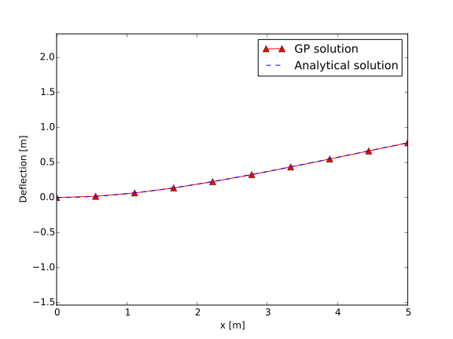

Examples
********

iPython Notebook Examples
=========================

More examples, including some with in-depth explanations and interactive visualizations, can be seen `on nbviewer <http://nbviewer.ipython.org/github/convexengineering/gpkit/tree/master/docs/source/ipynb/>`_.

A Trivial GP
============
The most trivial GP we can think of:
minimize :math:`x` subject to the constraint :math:`x \ge 1`.

.. literalinclude:: examples/x_greaterthan_1.py

Of course, the optimal value is 1. Output:

.. literalinclude:: examples/x_greaterthan_1_output.txt

Maximizing the Volume of a Box
==============================
This example comes from Section 2.4 of the `GP tutorial <http://stanford.edu/~boyd/papers/pdf/gp_tutorial.pdf>`_, by S. Boyd et. al.

.. literalinclude:: examples/simple_box.py

The output is

.. literalinclude:: examples/simple_box_output.txt

Water Tank
==========
Say we had a fixed mass of water we wanted to contain within a tank, but also wanted to minimize the cost of the material we had to purchase (i.e. the surface area of the tank):

.. literalinclude:: examples/water_tank.py

The output is

.. literalinclude:: examples/water_tank_output.txt

Simple Wing
===========
This example comes from Section 3 of `Geometric Programming for Aircraft Design Optimization <http://web.mit.edu/~whoburg/www/papers/hoburgabbeel2014.pdf>`_, by W. Hoburg and P. Abbeel.

.. literalinclude:: examples/simpleflight.py

The output is

.. literalinclude:: examples/simpleflight_output.txt

Simple Beam
===========
In this example we consider a beam subjected to a uniformly distributed transverse force along its length. The beam has fixed geometry so we are not optimizing its shape, rather we are simply solving a discretization of the Euler-Bernoulli beam bending equations using GP.

.. literalinclude:: examples/beam.py

The output is

.. literalinclude:: examples/beam_output.txt

By plotting the deflection, we can see that the agreement between the analytical solution and the GP solution is good.

.. Comments:

..
    .. literalinclude:: code/simple_box.py
        :language: python
        :emphasize-lines: 2-4, 6
        :lines: 1-7
