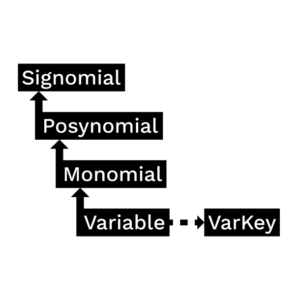
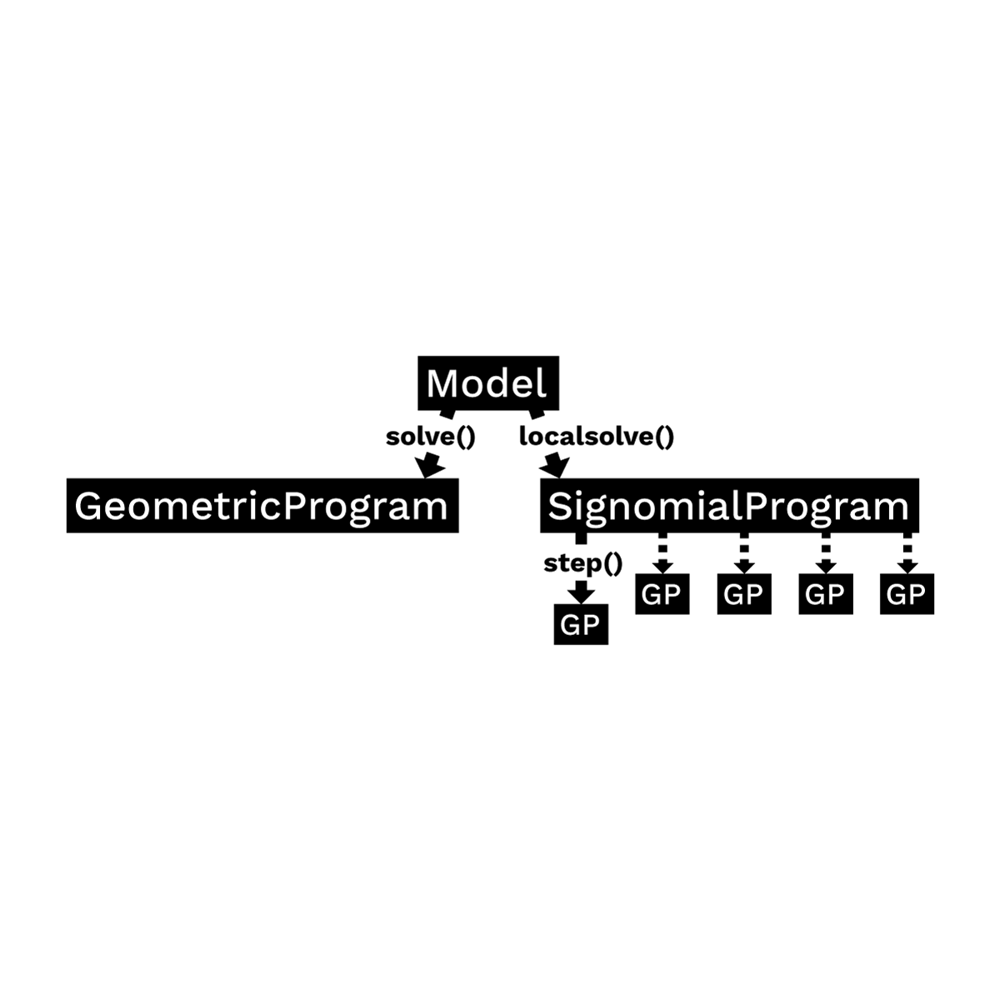

GPkit Overview
**************

GPkit is a Python package for defining and manipulating
geometric programming (GP) models,
abstracting away the backend solver.

Our hopes are to bring the mathematics of Geometric Programming
into the engineering design process
in a disciplined and collaborative way, and to
encourage research with and on GPs by providing an
easily extensible object-oriented framework.

Symbolic expressions
====================

GPkit is a limited symbolic algebra language, allowing only for the creation of geometric program compatible equations (or signomial program compatible ones, if signomial programming is enabled). As mentioned in :ref:`geometricprogramming`, one can view monomials as posynomials with a single term, and posynomials as signomials that have only positive coefficients. The inheritance structure of these objects in GPkit follows this mathematical basis.

Substitution
============

The ``Varkey`` object in the graph above is not a algebraic expression, but what GPkit uses as a variable's "name". It carries the LaTeX representation of a variable and its units, as well as any other information the user wishes to associate with a variable. The use of ``VarKeys`` as opposed to numeric indexing is an important part of the GPkit framework, because it allows a user to keep variable information local and modular.

GPkit keeps its internal representation of objects entirely symbolic until it solves. This means that any expression or Model object can replace any instance of a variable (as represented by a VarKey) with a number, new VarKey, or even an entire Monomial at any time with the ``.sub()`` method.

Model objects
=============

In GPkit, a ``Model`` object represents a symbolic problem declaration.
That problem may be either GP-compatible or SP-compatible.
To avoid confusion, calling the ``solve()`` method on a model will either attempt to solve it for a global optimum (if it's a GP) or return an error immediately (if it's an SP). Similarly, calling ``localsolve()`` will either start the process of SP-solving (stepping through a sequence of GP-approximations) or return an error for GP-compatible Models. This framework is illustrated below.

