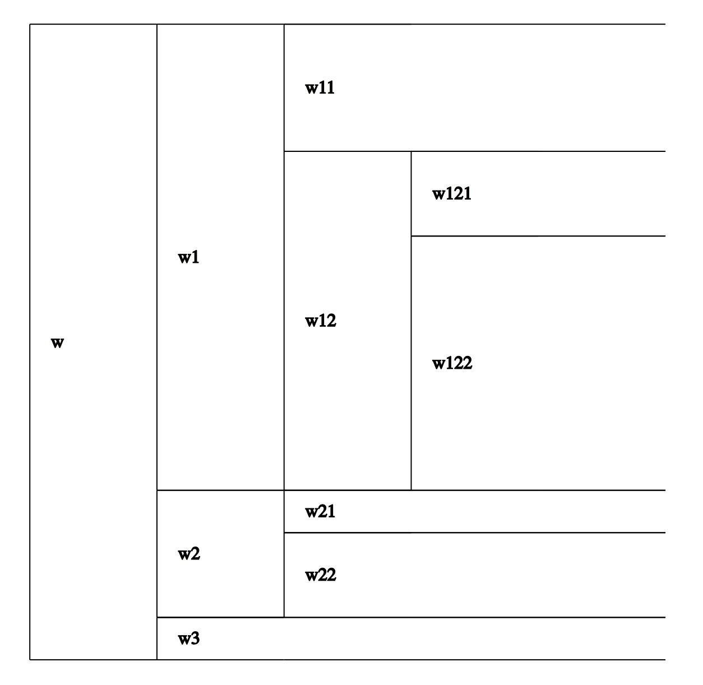

Graphics and Interactive Modules
*************

Breakdown Diagrams
====================
Breakdown diagrams, such as the one shown below, help visualize things like a  vehicle’s component by component weight breakdown or an airplane’s drag breakdown.

The first step in creating a breakdown diagram is to create a nested dict that represents the breakdown of interest. For example, consider a series of weights. There is the total weight ``w`` that is composed of two sub-weights, ``w1`` and ``w2``. ``w1`` has a value of 2 N and ``w2`` is composed of two sub weights, ``w21`` whose value is 2 N and ``w22`` whose value is 1 lbf. The nested dict representing this is ``{"w": {"w1": 2, "w2": {"w21": 2, "w22": [1, "lbf"]}}}``. A base unit will be set when constructing a ``Breakdown`` class, so values in units of N don’t need to have a unit declared in the dict. All values will be converted to the base unit when the breakdown diagram is scaled. Note that the keys of the input dict are used to label the breakdown diagram.

The ``Breakdown`` constraint set will take this input dict and automatically generate the following constraints.

.. math::

   w \geq w1 + w2
   w2 \geq w21 + 22

If a GP is formed consisting of these constraints and the objective ``w``, all weights will be properly summed. The solution to this GP can then be used to create a breakdown diagram. This is shown below.

.. literalinclude:: examples/breakdown_example.py
