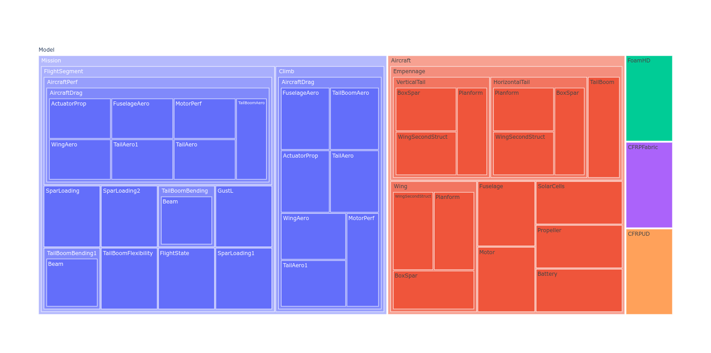
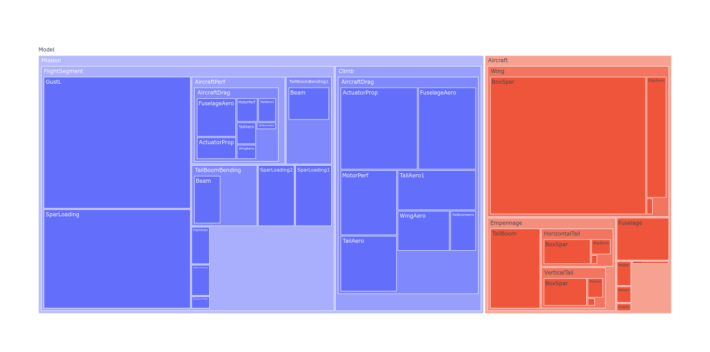
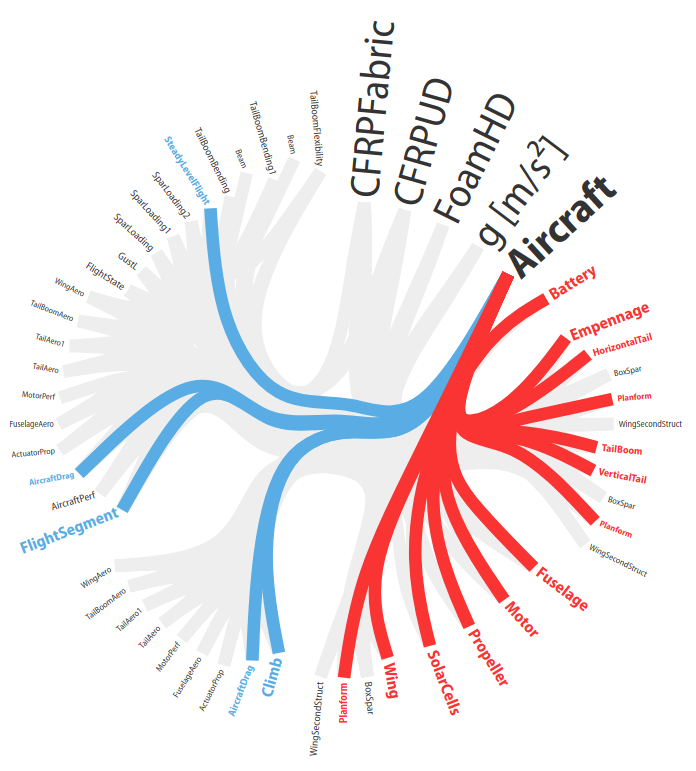
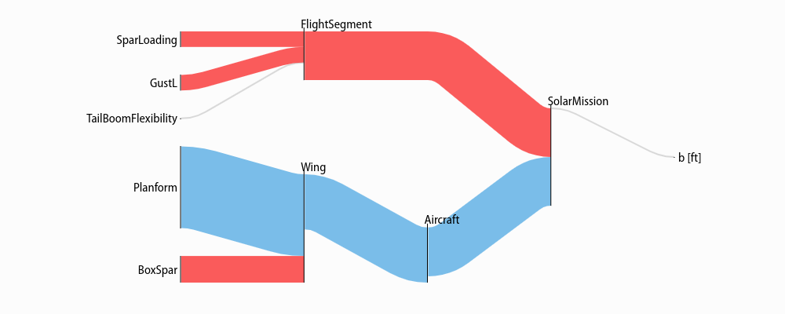
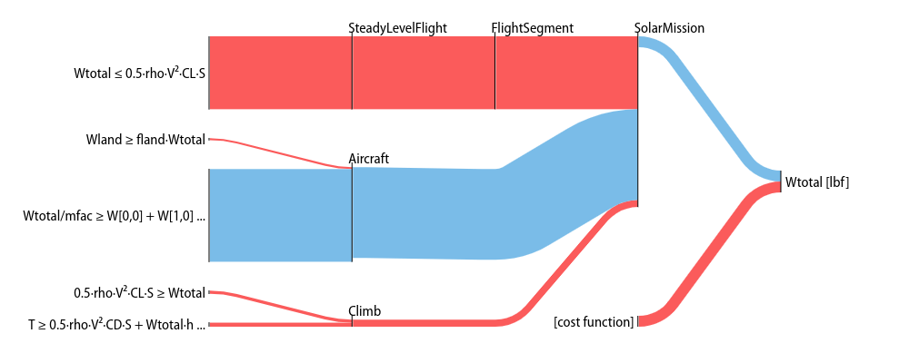
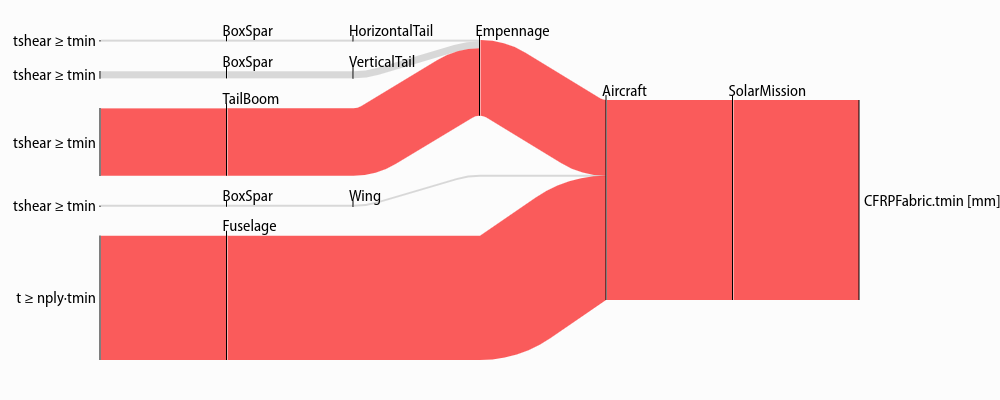
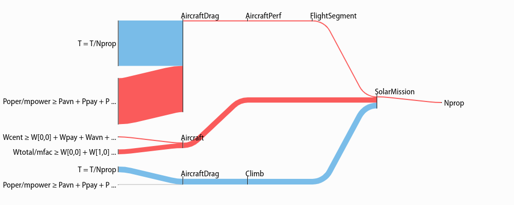
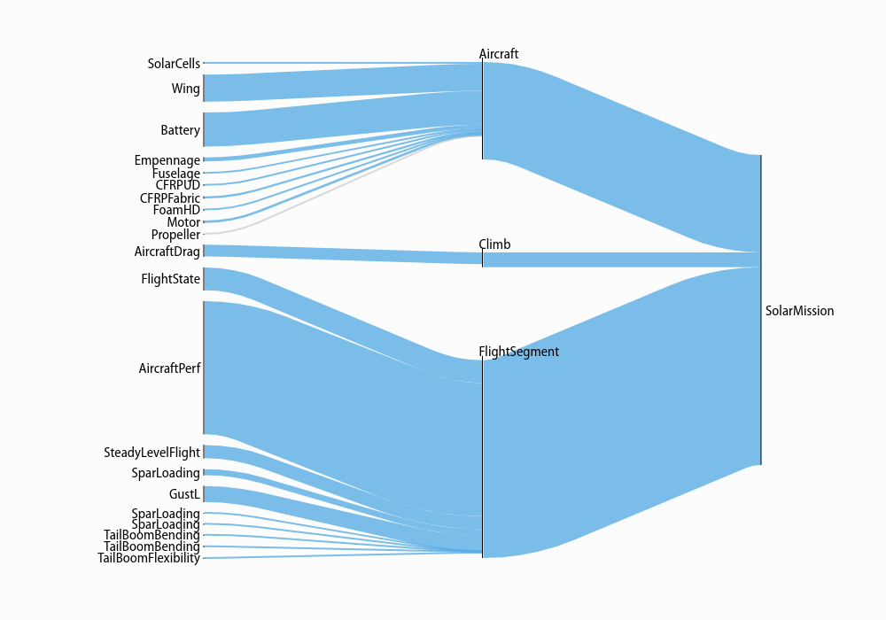
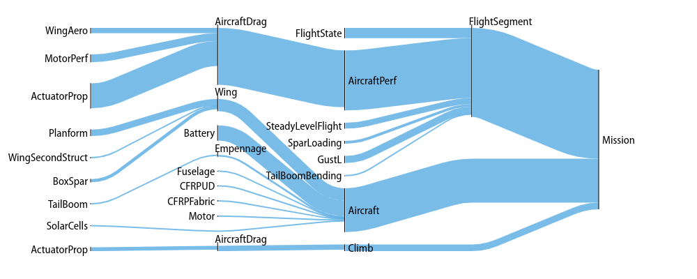

Visualization and Interaction
*****************************

Code in this section uses the `CE solar model <https://github.com/convexengineering/solar/tree/gpkitdocs>`_ except where noted otherwise.

Model and Variable Breakdowns
=============================

Model breakdowns (similar to the sankey diagrams below) show the hierarchy of a model scaled by the sensitivity of its constraints and fixed variables.

Variable breakdowns show how a variable "breaks down" into smaller expressions.
For example if the constraint ``x_total >= x1 + x2`` is tight (that is, has a sensitivity greater than zero, indicating that the right hand side is "pushing" against the left), then ``x_total`` can be said to "break down" into ``x1`` and ``x2``, each of which may have their own breakdowns. If multiple constraints break down a variable, the most sensitive one is chosen; if none do, than constraints such as ``1 >= x1/x_total + x2/x_total`` will be rearranged in an attempt to create a valid breakdown constraint like that above.

.. literalinclude:: examples/breakdowns.py

.. literalinclude:: examples/breakdowns_output.txt
    :language: breakdowns

If permissivity is greater than 1, the breakdown will always proceed if a breakdown variable is available in the monomial, and will choose the most sensitive one if multiple are available. If permissivity is 1, breakdowns will stop when there are multiple breakdown variables multiplying each other. If permissivity is 0, breakdowns will stop when any free variables multiply each other. If permissivity is between 0 and 1, it will follow the behavior for 1 if the monomial represents a fraction of the total greater than ``1 - permissivity``, and the behavior for 0 otherwise.

Model Hierarchy Treemaps
========================

.. code:: python

    import plotly
    from gpkit.interactive.plotting import treemap
    from solar.solar import *
    Vehicle = Aircraft(Npod=3, sp=True)
    M = Mission(Vehicle, latitude=[20])
    fig = treemap(M)
    plotly.offline.plot(fig, filename="treemap.html")

and, using sizing and counting by constraints instead of variables (the default):

.. code:: python

    fig = treemap(M, itemize="constraints", sizebycount=True)
    plotly.offline.plot(fig, filename="sizedtreemap.html")

Variable Reference Plots
========================

.. code:: python

    from solar.solar import *
    Vehicle = Aircraft(Npod=3, sp=True)
    M = Mission(Vehicle, latitude=[20])
    M.cost = M[M.aircraft.Wtotal]
    sol = M.localsolve()

    from gpkit.interactive.references import referencesplot
    referencesplot(M, openimmediately=True)

Running the code above will produce two files in your working directory:
``referencesplot.html`` and ``referencesplot.json``, and (unless you specify
``openimmediately=False``) open the former in your web browser,
showing you something like this:

`Click to see the interactive version of this plot. <https://web.mit.edu/eburn/www/referencesplot/referencesplot.html>`_

When a model's name is hovered over its connections are highlighted, showing in
red the other models it imports variables from to use in its constraints and in
blue the models that import variables from it.

By default connections are shown with equal width ("Unweighted").
When "Global Sensitivities" is selected, connection width is proportional to
the sensitivity of all variables in that connection to the importing model,
corresponding exactly to how much the model's cost would decrease if those variables were relaxed
in only that importing model. This can give a sense of which connections are vital to
the overall model. When "Normalized Sensitivities"  is selected, that
global weight is divided by the weight of all variables in the importing model,
giving a sense of which connections are vital to each subsystem.

.. _sankey:
Sensitivity Diagrams
====================

Requirements
------------
-  Jupyter Notebook
-  `ipysankeywidget <https://github.com/ricklupton/ipysankeywidget>`__
    - Note that you'll need to activate these widgets on Jupyter by runnning

      - ``jupyter nbextension enable --py --sys-prefix widgetsnbextension``

      - ``jupyter nbextension enable --py --sys-prefix ipysankeywidget``

Example
-------

.. code:: python

    from solar.solar import *
    Vehicle = Aircraft(Npod=3, sp=True)
    M = Mission(Vehicle, latitude=[20])
    M.cost = M[M.aircraft.Wtotal]
    sol = M.localsolve()

    from gpkit.interactive.sankey import Sankey

Once the code above has been run in a Jupyter notebook, the code below will create interactive hierarchies of your model's sensitivities, like so:

.. figure:: figures/Mission.gif

Explanation
-----------

`Sankey
diagrams <https://en.wikipedia.org/wiki/Sankey_diagram>`__ can be used to
visualize sensitivity structure in a model. A blue flow from a constraint to its parent
indicates that the sensitivity of the chosen variable (or of making the
constraint easier, if no variable is given) is negative; that
is, the objective of the overall model would improve if that variable's
value were increased *in that constraint alone*. Red indicates a
positive sensitivity: the objective and the the constraint 'want' that
variable's value decreased. Gray flows indicate a sensitivity whose
absolute value is below ``1e-2``, i.e. a constraint that is inactive for
that variable. Where equal red and blue flows meet, they cancel each
other out to gray.

Usage
-----

Variables
~~~~~~~~~

In a Sankey diagram of a variable, the variable is on the right with its
final sensitivity; to the left of it are all constraints that variable
is in.

Free
^^^^

Free variables have an overall sensitivity of 0, so this visualization
shows how the various pressures on that variable in all its constraints
cancel each other out; this can get quite complex, as in this diagram of the
pressures on wingspan (right-click and open in a new tab to see it more clearly):

.. code:: python

    Sankey(sol, M, "SolarMission").diagram(M.aircraft.wing.planform.b, showconstraints=False)

Gray lines in this diagram indicate constraints or constraint sets that the variable is in
but which have no net sensitivity to it. Note that the ``showconstraints``
argument can be used to hide constraints if you
wish to see more of the model hierarchy with the same number of links.

Variable in the cost function, have a "[cost function]" node on the diagram like so:

.. code:: python

    Sankey(sol, M, "SolarMission").diagram(M.aircraft.Wtotal)

Fixed
^^^^^

Fixed variables can have a nonzero overall sensitivity. Sankey diagrams
can how that sensitivity comes together:

.. code:: python

    Sankey(sol, M, "SolarMission").diagram(M.variables_byname("tmin")[0], left=100)

Note that the ``left=`` syntax is used to reduce the left margin in this plot.
Similar arguments exist for the ``right``, ``top``, and ``bottom`` margins:
all arguments are in pixels.

The only difference between free and fixed variables from this perspective
is their final sensitivity; for example ``Nprop``, the number of propellers on the
plane, has almost zero sensitivity, much like the wingspan ``b``, above.

.. code:: python

    Sankey(sol, M, "SolarMission").diagram(M["Nprop"])

Models
~~~~~~

When created without a variable, the diagram shows the sensitivity of
every named model to becoming locally easier. Because derivatives are
additive, these sensitivities are too: a model's sensitivity is equal to
the sum of its constraints' sensitivities and the magnitude of its
fixed-variable sensitivities. Gray lines in this diagram indicate models
without any tight constraints or sensitive fixed variables.

.. code:: python

    Sankey(sol, M, "SolarMission").diagram(maxlinks=30, showconstraints=False, height=700)

Note that in addition to the ``showconstraints`` syntax introduced above,
this uses two additional arguments you may find useful when visualizing large models:
``height`` sets the height of the diagram in pixels (similarly for ``width``),
while ``maxlinks`` increases the maximum number of links (default 20), making
a more detailed plot. Plot construction time goes approximately as the square
of the number of links, so be careful when increasing ``maxlinks``!

With some different arguments, the model looks like this:

.. code:: python

    Sankey(sol, M).diagram(minsenss=1, maxlinks=30, left=130, showconstraints=False)

The only piece of unexplained syntax in this is ``minsenss``. Perhaps
unsurprisingly, this just limits the links shown to only those whose sensitivity
exceeds that minimum; it's quite useful for exploring a large model.

Plotting a 1D Sweep
==================

Methods exist to facilitate creating, solving, and plotting the results of a single-variable sweep (see :ref:`Sweeps` for details). Example usage is as follows:

.. literalinclude:: examples/plot_sweep1d.py

Which results in:

.. figure:: examples/plot_sweep1d.png
    :align: center

.. figure:: examples/plot_autosweep1d.png
    :align: center
