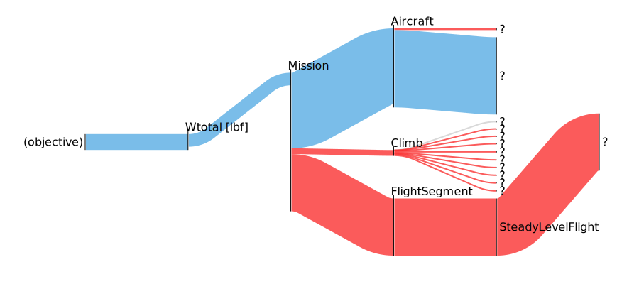
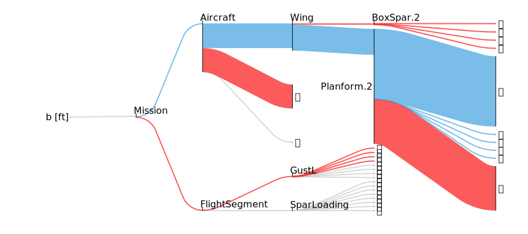
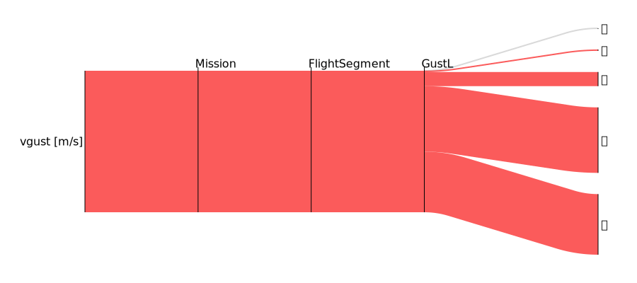
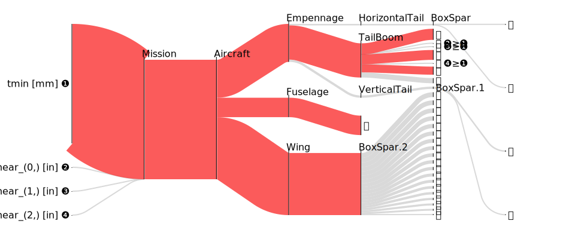
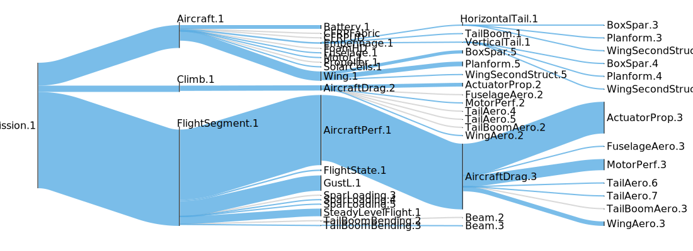
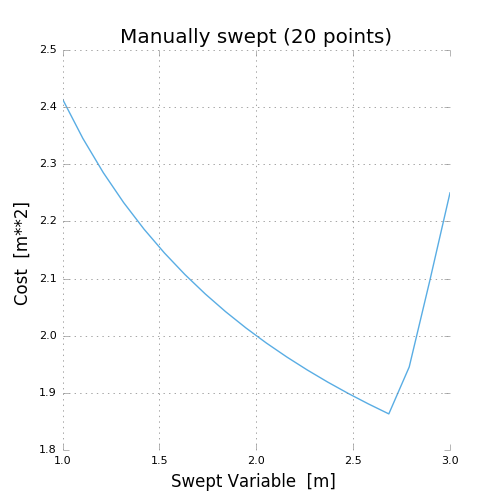
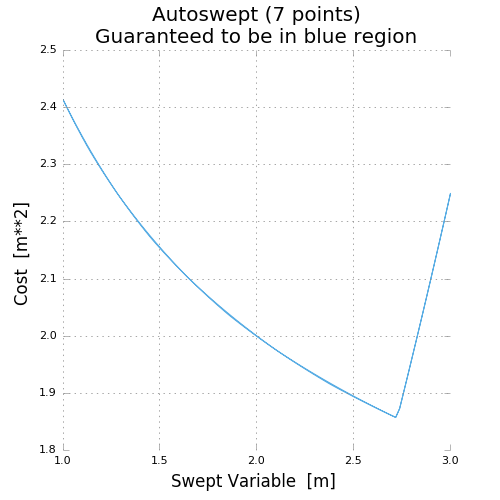

Visualization and Interaction
*****************************

Sankey Diagrams
===============

Requirements
------------
-  jupyter notebook
-  `ipysankeywidget <https://github.com/ricklupton/ipysankeywidget>`__

Example
-------

Code in this section uses the `CE solar model <https://github.com/convexengineering/solar/tree/gpkitdocs>`__

.. code:: python

    from solar import *
    Vehicle = Aircraft(Npod=1, sp = False)
    M = Mission(Vehicle, latitude=[20])
    M.cost = M[M.aircraft.Wtotal]
    sol = M.solve()

    from gpkit.interactive.sankey import Sankey
    Sankey(M).diagram(M.aircraft.Wtotal)

::

    (objective) adds +1 to the sensitivity of Wtotal_Aircraft
    (objective) is Wtotal_Aircraft [lbf] 

    Ⓐ adds +0.0075 to the overall sensitivity of Wtotal_Aircraft
    Ⓐ is Wtotal_Aircraft <= 0.5*CL_Mission/Climb/AircraftDrag/WingAero_(0,)*S_Aircraft/Wing/Planform.2*V_Mission/Climb_(0, 0)**2*rho_Mission/Climb_(0, 0) 

    Ⓑ adds +0.0117 to the overall sensitivity of Wtotal_Aircraft
    Ⓑ is Wtotal_Aircraft <= 0.5*CL_Mission/Climb/AircraftDrag/WingAero_(1,)*S_Aircraft/Wing/Planform.2*V_Mission/Climb_(0, 1)**2*rho_Mission/Climb_(0, 1) 

Explanation
-----------

`Sankey
diagrams <https://en.wikipedia.org/wiki/Sankey_diagram>`__ can be used to
visualize sensitivity structure in a model. A blue flow from a constraint to its parent
indicates that the sensitivity of the chosen variable (or of making the
constraint easier, if no variable is given) is negative; that
is, the objective of the overall model would improve if that variable's
value were increased *in that constraint alone*. Red indicates a
positive sensitivity: the objective and the the constraint 'want' that
variable's value decreased. Gray flows indicate a sensitivity whose
absolute value is below ``1e-7``, i.e. a constraint that is inactive for
that variable. Where equal red and blue flows meet, they cancel each
other out to gray.

Usage
-----

Variables
~~~~~~~~~

In a Sankey diagram of a variable, the variable is on the left with its
final sensitivity; to the right of it are all constraints that variable
is in.

Free
^^^^

Free variables have an overall sensitivity of 0, so this visualization
shows how the various pressures on that variable in all its constraints
cancel each other out; this can get quite complex, as in this diagram of the
pressures on wingspan:

.. code:: python

    Sankey(M).diagram(M.aircraft.b)

Fixed
^^^^^

Fixed variables can have a nonzero overall sensitivity. Sankey diagrams
can how that sensitivity comes together:

.. code:: python

Sankey(M).diagram(M['vgust'])

Equivalent Variables
^^^^^^^^^^^^^^^^^^^^

If any variables are equal to the diagram's variable (modulo some
constant factor; e.g. ``2*x == y`` counts for this, as does ``2*x <= y``
if the constraint is sensitive), they are found and plotted
at the same time, and all shown on the left. The constraints responsible
for this are shown next to their labels.

.. code:: python

    Sankey(M).sorted_by('constraints', 11)

Models
~~~~~~

When created without a variable, the diagram shows the sensitivity of
every named model to becoming locally easier. Because derivatives are
additive, these sensitivities are too: a model's sensitivity is equal to
the sum of its constraints' sensitivities. Gray lines in this diagram
indicate models without any tight constraints.

.. code:: python

    Sankey(M).diagram(left=60, right=90, width=1050)

Syntax
------

+-------------------------------+-------------------------------------------------------------------------------+
| Code                          | Result                                                                        |
+===============================+===============================================================================+
| ``s = Sankey(M)``             | Creates Sankey object of a given model                                        |
+-------------------------------+-------------------------------------------------------------------------------+
| ``s.diagram(vars)``           | Creates the diagram in a way Jupyter knows how to present                     |
+-------------------------------+-------------------------------------------------------------------------------+
| ``d = s.diagram()``           | **Don't do this!** Captures output, preventing Jupyter from seeing it.        |
+-------------------------------+-------------------------------------------------------------------------------+
| ``s.diagram(width=...)``      | Sets width in pixels. Same for height.                                        |
+-------------------------------+-------------------------------------------------------------------------------+
| ``s.diagram(left=...)``       | Sets top margin in pixels. Same for right, top. bottom.                       |
|                               | Use if the left-hand text is being cut off.                                   |
+-------------------------------+-------------------------------------------------------------------------------+
| ``s.diagram(flowright=True)`` | Shows the variable / top constraint on the right instead of the left.         |
+-------------------------------+-------------------------------------------------------------------------------+
| ``s.sorted_by("maxflow", 0)`` | Creates diagram of the variable with the largest single constraint            |
|                               | sensitivity. (change the ``0`` index to go down the list)                     |
+-------------------------------+-------------------------------------------------------------------------------+
| ``s.sorted_by("constraints",  | Creates diagram of the variable that's in the most constraints.               |
| 0)``                          | (change the ``0`` index to go down the list)                                  |
+-------------------------------+-------------------------------------------------------------------------------+

Plotting a 1D Sweep
==================

Methods exist to facilitate creating, solving, and plotting the results of a single-variable sweep (see :ref:`Sweeps` for details). Example usage is as follows:

.. literalinclude:: examples/plot_sweep1d.py

Which results in:

