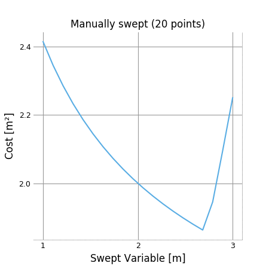

Visualization and Interaction
*****************************

Plotting a 1D Sweep
==================

Methods exist to facilitate creating, solving, and plotting the results of a single-variable sweep (see :ref:`Sweeps` for details). Example usage is as follows:

.. literalinclude:: examples/plot_sweep1d.py

Which results in:

.. figure:: examples/plot_autosweep1d.png
    :align: center

.. _sankey:
Sensitivity Diagrams
====================

Requirements
------------
-  Jupyter Notebook
-  `ipysankeywidget <https://github.com/ricklupton/ipysankeywidget>`__

Example
-------

Code in this section uses the `CE solar model <https://github.com/convexengineering/solar/tree/gpkitdocs>`__

.. code:: python

    from solar.solar import *
    Vehicle = Aircraft(Npod=3, sp=True)
    M = Mission(Vehicle, latitude=[20])
    M.cost = M[M.aircraft.Wtotal]
    sol = M.localsolve("mosek_cli")

    from gpkit.interactive.sankey import Sankey
    Sankey(sol, M, "SolarMission").diagram(M.aircraft.Wtotal, left=210, right=130)

.. figure:: figures/solar/SolarMission_Wtotal.png

Explanation
-----------

`Sankey
diagrams <https://en.wikipedia.org/wiki/Sankey_diagram>`__ can be used to
visualize sensitivity structure in a model. A blue flow from a constraint to its parent
indicates that the sensitivity of the chosen variable (or of making the
constraint easier, if no variable is given) is negative; that
is, the objective of the overall model would improve if that variable's
value were increased *in that constraint alone*. Red indicates a
positive sensitivity: the objective and the the constraint 'want' that
variable's value decreased. Gray flows indicate a sensitivity whose
absolute value is below ``1e-2``, i.e. a constraint that is inactive for
that variable. Where equal red and blue flows meet, they cancel each
other out to gray.

Usage
-----

Variables
~~~~~~~~~

In a Sankey diagram of a variable, the variable is on the left with its
final sensitivity; to the right of it are all constraints that variable
is in.

Free
^^^^

Free variables have an overall sensitivity of 0, so this visualization
shows how the various pressures on that variable in all its constraints
cancel each other out; this can get quite complex, as in this diagram of the
pressures on wingspan:

.. code:: python

    Sankey(sol, M, "SolarMission").diagram(M.aircraft.b, right=180)

.. figure:: figures/solar/SolarMission_b.png

Fixed
^^^^^

Fixed variables can have a nonzero overall sensitivity. Sankey diagrams
can how that sensitivity comes together:

.. code:: python

    Sankey(sol, M, "SolarMission").diagram(M.variables_byname("tmin")[0], right=160, left=10)

.. figure:: figures/solar/SolarMission_tmin.png

Note that the only difference between free and fixed variabels from this perspective
is their final sensitivity; for example ``Nprop``, the number of propellers on the
plane, has almost zero sensitivity, much like the wingspan ``b``, above.

.. code:: python

    Sankey(sol, M, "SolarMission").diagram(M.variables_byname("tmin")[0], right=160, left=10)

.. figure:: figures/solar/SolarMission_Nprop.png

Models
~~~~~~

When created without a variable, the diagram shows the sensitivity of
every named model to becoming locally easier. Because derivatives are
additive, these sensitivities are too: a model's sensitivity is equal to
the sum of its constraints' sensitivities and the magnitude of its
fixed-variable sensitivities. Gray lines in this diagram indicate models
without any tight constraints or sensitive fixed variables.

.. code:: python

    Sankey(sol, M, "SolarMission").diagram(height=600)

.. figure:: figures/solar/SolarMission.png

Syntax
------

+-------------------------------+-------------------------------------------------------------------------------+
| Code                          | Result                                                                        |
+===============================+===============================================================================+
| ``s = Sankey(M)``             | Creates Sankey object of a given model                                        |
+-------------------------------+-------------------------------------------------------------------------------+
| ``s.diagram(vars)``           | Creates the diagram in a way Jupyter knows how to present                     |
+-------------------------------+-------------------------------------------------------------------------------+
| ``d = s.diagram()``           | **Don't do this!** Captures output, preventing Jupyter from seeing it.        |
+-------------------------------+-------------------------------------------------------------------------------+
| ``s.diagram(width=...)``      | Sets width in pixels. Same for height.                                        |
+-------------------------------+-------------------------------------------------------------------------------+
| ``s.diagram(left=...)``       | Sets left (top, right, bottom) margin in pixels.                              |
|                               | Use if text is being cut off.                                                 |
+-------------------------------+-------------------------------------------------------------------------------+
