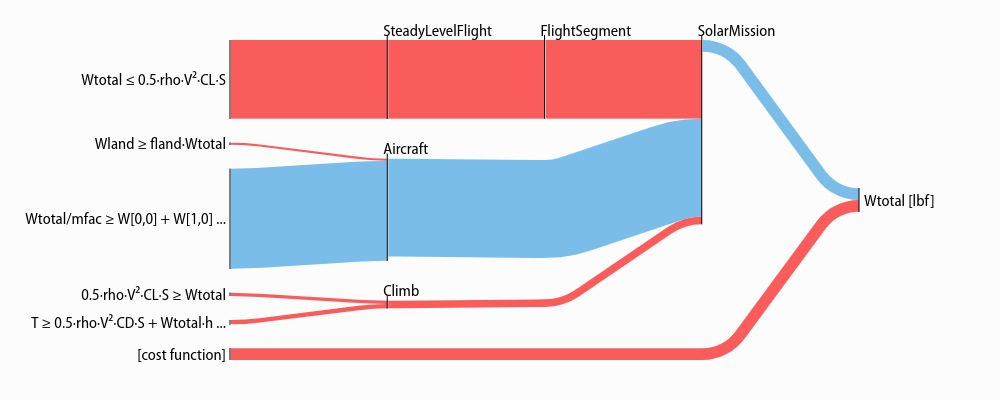
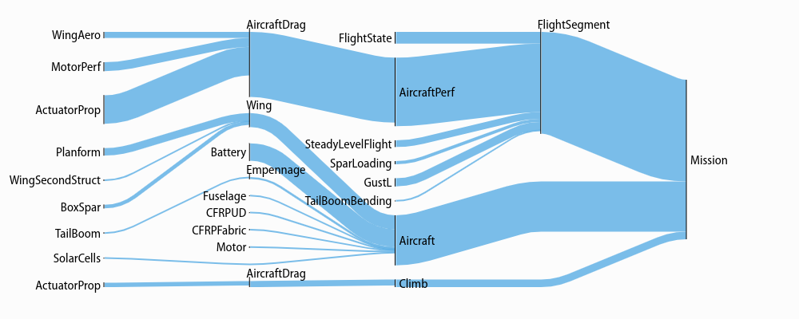

Visualization and Interaction
*****************************
.. _sankey:
Sensitivity Diagrams
====================

Requirements
------------
-  Jupyter Notebook
-  `ipysankeywidget <https://github.com/ricklupton/ipysankeywidget>`__

Example
-------

Code in this section uses the `CE solar model <https://github.com/convexengineering/solar/tree/gpkitdocs>`_

.. code:: python

    from solar.solar import *
    Vehicle = Aircraft(Npod=3, sp=True)
    M = Mission(Vehicle, latitude=[20])
    M.cost = M[M.aircraft.Wtotal]
    sol = M.localsolve("mosek_cli")

    from gpkit.interactive.sankey import Sankey

.. figure:: figures/Mission.gif

Explanation
-----------

`Sankey
diagrams <https://en.wikipedia.org/wiki/Sankey_diagram>`__ can be used to
visualize sensitivity structure in a model. A blue flow from a constraint to its parent
indicates that the sensitivity of the chosen variable (or of making the
constraint easier, if no variable is given) is negative; that
is, the objective of the overall model would improve if that variable's
value were increased *in that constraint alone*. Red indicates a
positive sensitivity: the objective and the the constraint 'want' that
variable's value decreased. Gray flows indicate a sensitivity whose
absolute value is below ``1e-2``, i.e. a constraint that is inactive for
that variable. Where equal red and blue flows meet, they cancel each
other out to gray.

Usage
-----

Variables
~~~~~~~~~

In a Sankey diagram of a variable, the variable is on the right with its
final sensitivity; to the left of it are all constraints that variable
is in.

Free
^^^^

Free variables have an overall sensitivity of 0, so this visualization
shows how the various pressures on that variable in all its constraints
cancel each other out; this can get quite complex, as in this diagram of the
pressures on wingspan:

.. code:: python

    Sankey(sol, M, "SolarMission").diagram(M.aircraft.wing.planform.b, showconstraints=False)

Gray lines in this diagram indicate constraints or constraint sets that the variable is in
but which have no net sensitivity to it. Note that the ``showconstraints``
argument can be used to hide constraints if you
wish to see more of the model hierarchy with the same number of links.

Variable in the cost function, have a "[cost function]" node on the diagram like so:

.. code:: python

    Sankey(sol, M, "SolarMission").diagram(M.aircraft.Wtotal)

Fixed
^^^^^

Fixed variables can have a nonzero overall sensitivity. Sankey diagrams
can how that sensitivity comes together:

.. code:: python

    Sankey(sol, M, "SolarMission").diagram(M.variables_byname("tmin")[0], left=100)

Note that the ``left=`` syntax is used to reduce the left margin in this plot.
Similar arguments exist for the ``right``, ``top``, and ``bottom`` margins:
all arguments are in pixels.

The only difference between free and fixed variables from this perspective
is their final sensitivity; for example ``Nprop``, the number of propellers on the
plane, has almost zero sensitivity, much like the wingspan ``b``, above.

.. code:: python

    Sankey(sol, M, "SolarMission").diagram(M["Nprop"])

Models
~~~~~~

When created without a variable, the diagram shows the sensitivity of
every named model to becoming locally easier. Because derivatives are
additive, these sensitivities are too: a model's sensitivity is equal to
the sum of its constraints' sensitivities and the magnitude of its
fixed-variable sensitivities. Gray lines in this diagram indicate models
without any tight constraints or sensitive fixed variables.

.. code:: python

    Sankey(sol, M, "SolarMission").diagram(maxlinks=30, showconstraints=False, height=700)

Note that in addition to the ``showconstraints`` syntax introduced above,
this uses two additional arguments you may find useful when visualizing large models:
``height`` sets the height of the diagram in pixels (similarly for ``width``),
while ``maxlinks`` increases the maximum number of links (default 20), making
a more detailed plot. Plot construction time goes approximately as the square
of the number of links, so be careful when increasing ``maxlinks``!

With some different arguments, the model looks like this:

.. code:: python

    Sankey(sol, M).diagram(minsenss=1, maxlinks=30, left=130, showconstraints=False)

The only piece of unexplained syntax in this is ``minsenss``. Perhaps
unsurprisingly, this just limits the links shown to only those whose sensitivity
exceeds that minimum; it's quite useful for exploring a large model.

Plotting a 1D Sweep
==================

Methods exist to facilitate creating, solving, and plotting the results of a single-variable sweep (see :ref:`Sweeps` for details). Example usage is as follows:

.. literalinclude:: examples/plot_sweep1d.py

Which results in:

.. figure:: examples/plot_sweep1d.png
    :align: center

.. figure:: examples/plot_autosweep1d.png
    :align: center
