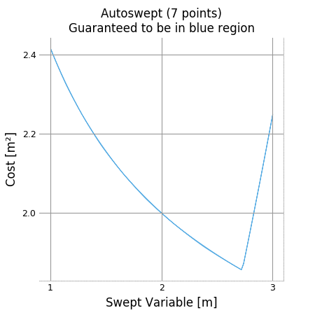

Visualization and Interaction
*****************************

Interactive Control Panel
=========================

A model can be manipulated and visualized in Jupyter Notebook by calling ``model.controlpanel()``. By default this creates a slider for every constant in the model and gives them automatic ranges, but variables and/or ranges can be changed in the Settings tab or specified in the first argument to ``controlpanel()``.

Besides the default behaviour shown above, the control panel can also display custom analyses and plots via the  ``fn_of_sol`` argument, which accepts a function (or list of functions) that take the solution as their input.

Plotting a 1D Sweep
==================

Methods exist to facilitate creating, solving, and plotting the results of a single-variable sweep (see :ref:`Sweeps` for details). Example usage is as follows:

.. literalinclude:: examples/plot_sweep1d.py

Which results in:

.. figure:: examples/plot_sweep1d.png
    :align: center

