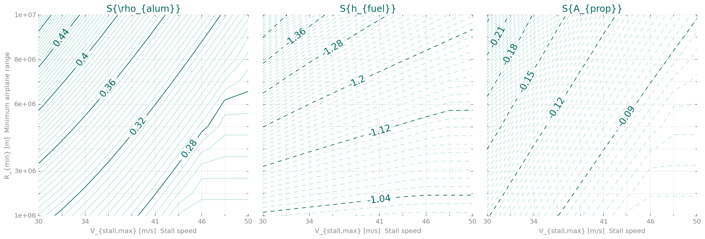

.. figure::  fuellogo.svg
   :align:   left
   :width: 150 px

AIRPLANE FUEL
=============

*Minimize fuel needed for a plane that can sprint and land quickly.*

Set up the modelling environment
~~~~~~~~~~~~~~~~~~~~~~~~~~~~~~~~

First we'll to import GPkit and turn on :math:`\LaTeX` printing for
GPkit variables and equations.

.. code:: python

    import numpy as np
    import gpkit
    import gpkit.interactive
    gpkit.interactive.init_printing()
declare constants
~~~~~~~~~~~~~~~~~

.. code:: python

    mon = gpkit.Variable
    vec = gpkit.VectorVariable
    
    N_lift         = mon("N_{lift}", 6.0, "-", "Wing loading multiplier")
    pi             = mon("\\pi", np.pi, "-", "Half of the circle constant")
    sigma_max      = mon("\\sigma_{max}", 250e6, "Pa", "Allowable stress, 6061-T6")
    sigma_maxshear = mon("\\sigma_{max,shear}", 167e6, "Pa", "Allowable shear stress")
    g              = mon("g", 9.8, "m/s^2", "Gravitational constant")
    w              = mon("w", 0.5, "-", "Wing-box width/chord")
    r_h            = mon("r_h", 0.75, "-", "Wing strut taper parameter")
    f_wadd         = mon("f_{wadd}", 2, "-", "Wing added weight fraction")
    W_fixed        = mon("W_{fixed}", 14.7e3, "N", "Fixed weight")
    C_Lmax         = mon("C_{L,max}", 1.5, "-", "Maximum C_L, flaps down")
    rho            = mon("\\rho", 0.91, "kg/m^3", "Air density, 3000m")
    rho_sl         = mon("\\rho_{sl}", 1.23, "kg/m^3", "Air density, sea level")
    rho_alum       = mon("\\rho_{alum}", 2700, "kg/m^3", "Density of aluminum")
    mu             = mon("\\mu", 1.69e-5, "kg/m/s", "Dynamic viscosity, 3000m")
    e              = mon("e", 0.95, "-", "Wing spanwise efficiency")
    A_prop         = mon("A_{prop}", 0.785, "m^2", "Propeller disk area")
    eta_eng        = mon("\\eta_{eng}", 0.35, "-", "Engine efficiency")
    eta_v          = mon("\\eta_v", 0.85, "-", "Propeller viscous efficiency")
    h_fuel         = mon("h_{fuel}", 42e6, "J/kg", "fuel heating value")
    V_sprint_reqt  = mon("V_{sprintreqt}", 150, "m/s", "sprint speed requirement")
    W_pay          = mon("W_{pay}", 500*9.81, "N")
    R_min          = mon("R_{min}", 1e6, "m", "Minimum airplane range")
    V_stallmax     = mon("V_{stall,max}", 40, "m/s", "Stall speed")
    # sweep variables
    R_min          = mon("R_{min}", np.linspace(1e6, 1e7, 10), "m", "Minimum airplane range")
    V_stallmax     = mon("V_{stall,max}", np.linspace(30, 50, 10), "m/s", "Stall speed")
declare free variables
~~~~~~~~~~~~~~~~~~~~~~

.. code:: python

    V        = vec(3, "V", "m/s", "Flight speed")
    C_L      = vec(3, "C_L", "-", "Wing lift coefficent")
    C_D      = vec(3, "C_D", "-", "Wing drag coefficent")
    C_Dfuse  = vec(3, "C_{D_{fuse}}", "-", "Fuselage drag coefficent")
    C_Dp     = vec(3, "C_{D_p}", "-", "drag model parameter")
    C_Di     = vec(3, "C_{D_i}", "-", "drag model parameter")
    T        = vec(3, "T", "N", "Thrust force")
    Re       = vec(3, "Re", "-", "Reynold's number")
    W        = vec(3, "W", "N", "Aircraft weight")
    eta_i    = vec(3, "\\eta_i", "-", "Aircraft efficiency")
    eta_prop = vec(3, "\\eta_{prop}", "-")
    eta_0    = vec(3, "\\eta_0", "-")
    W_fuel   = vec(2, "W_{fuel}", "N", "Fuel weight")
    z_bre    = vec(2, "z_{bre}", "-")
    S        = mon("S", "m^2", "Wing area")
    R        = mon("R", "m", "Airplane range")
    A        = mon("A", "-", "Aspect Ratio")
    I_cap    = mon("I_{cap}", "m^4", "Spar cap area moment of inertia per unit chord")
    M_rbar   = mon("\\bar{M}_r", "-")
    P_max    = mon("P_{max}", "W")
    V_stall  = mon("V_{stall}", "m/s")
    nu       = mon("\\nu", "-")
    p        = mon("p", "-")
    q        = mon("q", "-")
    tau      = mon("\\tau", "-")
    t_cap    = mon("t_{cap}", "-")
    t_web    = mon("t_{web}", "-")
    W_cap    = mon("W_{cap}", "N")
    W_zfw    = mon("W_{zfw}", "N", "Zero fuel weight")
    W_eng    = mon("W_{eng}", "N")
    W_mto    = mon("W_{mto}", "N", "Maximum takeoff weight")
    W_pay    = mon("W_{pay}", "N")
    W_tw     = mon("W_{tw}", "N")
    W_web    = mon("W_{web}", "N")
    W_wing   = mon("W_{wing}", "N")
Let's check that the vector constraints are working:

.. code:: python

    W == 0.5*rho*C_L*S*V**2

.. math::

    \begin{bmatrix}{W}_{0} = 0.5S \rho {V}_{0}^{2} {C_L}_{0} & {W}_{1} = 0.5S \rho {V}_{1}^{2} {C_L}_{1} & {W}_{2} = 0.5S \rho {V}_{2}^{2} {C_L}_{2}\end{bmatrix}

Looks good!

Form the optimization problem
~~~~~~~~~~~~~~~~~~~~~~~~~~~~~

In the 3-element vector variables, indexs 0, 1, and 2 are the outbound,
return and sprint flights.

.. code:: python

    steady_level_flight = (W == 0.5*rho*C_L*S*V**2,
                           T >= 0.5*rho*C_D*S*V**2,
                           Re == (rho/mu)*V*(S/A)**0.5)
    
    landing_fc = (W_mto <= 0.5*rho_sl*V_stall**2*C_Lmax*S,
                  V_stall <= V_stallmax)
    
    sprint_fc = (P_max >= T[2]*V[2]/eta_0[2],
                 V[2] >= V_sprint_reqt)
    
    drag_model = (C_D >= (0.05/S)*gpkit.units.m**2 +C_Dp + C_L**2/(pi*e*A),
                  1 >= (2.56*C_L**5.88/(Re**1.54*tau**3.32*C_Dp**2.62) +
                       3.8e-9*tau**6.23/(C_L**0.92*Re**1.38*C_Dp**9.57) +
                       2.2e-3*Re**0.14*tau**0.033/(C_L**0.01*C_Dp**0.73) +
                       1.19e4*C_L**9.78*tau**1.76/(Re*C_Dp**0.91) +
                       6.14e-6*C_L**6.53/(Re**0.99*tau**0.52*C_Dp**5.19)))
    
    propulsive_efficiency = (eta_0 <= eta_eng*eta_prop,
                             eta_prop <= eta_i*eta_v,
                             4*eta_i + T*eta_i**2/(0.5*rho*V**2*A_prop) <= 4)
    
    # 4th order taylor approximation for e^x
    z_bre_sum = 0
    for i in range(1,5):
        z_bre_sum += z_bre**i/np.math.factorial(i)
    
    range_constraints = (R >= R_min,
                         z_bre >= g*R*T[:2]/(h_fuel*eta_0[:2]*W[:2]),
                         W_fuel/W[:2] >= z_bre_sum)
    
    weight_relations = (W_pay >= 500*g*gpkit.units.kg,
                        W_tw >= W_fixed + W_pay + W_eng,
                        W_zfw >= W_tw + W_wing,
                        W_eng >= 0.0372*P_max**0.8083 * gpkit.units.parse_expression('N/W^0.8083'),
                        W_wing/f_wadd >= W_cap + W_web,
                        W[0] >= W_zfw + W_fuel[1],
                        W[1] >= W_zfw,
                        W_mto >= W[0] + W_fuel[0],
                        W[2] == W[0])
    
    wing_structural_model = (2*q >= 1 + p,
                             p >= 1.9,
                             tau <= 0.15,
                             M_rbar >= W_tw*A*p/(24*gpkit.units.N),
                             .92**2/2.*w*tau**2*t_cap >= I_cap * gpkit.units.m**-4 + .92*w*tau*t_cap**2,
                             8 >= N_lift*M_rbar*A*q**2*tau/S/I_cap/sigma_max * gpkit.units.parse_expression('Pa*m**6'),
                             12 >= A*W_tw*N_lift*q**2/tau/S/t_web/sigma_maxshear,
                             nu**3.94 >= .86*p**-2.38 + .14*p**0.56,
                             W_cap >= 8*rho_alum*g*w*t_cap*S**1.5*nu/3/A**.5,
                             W_web >= 8*rho_alum*g*r_h*tau*t_web*S**1.5*nu/3/A**.5
                             )
.. code:: python

    eqns = (weight_relations + range_constraints + propulsive_efficiency
            + drag_model + steady_level_flight + landing_fc + sprint_fc + wing_structural_model)
    
    gp = gpkit.GP(W_fuel.sum(), eqns)
Design a hundred airplanes
~~~~~~~~~~~~~~~~~~~~~~~~~~

.. code:: python

    sol = gp.solve()

.. parsed-literal::

    Using solver 'cvxopt'
    Sweeping 2 variables over 100 passes
    Solving took 9.96 seconds

The "local model" is the power-law tangent to the Pareto frontier,
gleaned from sensitivities.

.. code:: python

    sol["local_model"][0].sub(gp.substitutions)

.. math::

    0.006484\frac{R_{min}}{V_{stall,max}^{0.59}}

plot design frontiers
~~~~~~~~~~~~~~~~~~~~~

.. code:: python

    %matplotlib inline
    %config InlineBackend.figure_format = 'retina'
    
    plot_frontiers = gpkit.interactive.plot_frontiers
    plot_frontiers(gp, [V[0], V[1], V[2]])
    plot_frontiers(gp, [S, W_zfw, P_max])
    plot_frontiers(gp, ['S{\\rho_{alum}}', 'S{h_{fuel}}', 'S{A_{prop}}'])

.. image:: Fuel_files/Fuel_17_0.png

.. image:: Fuel_files/Fuel_17_1.png

Interactive analysis
~~~~~~~~~~~~~~~~~~~~

Let's investigate it with the
`cadtoons <https://github.com/bqpd/cadtoons>`__ library. Running
``cadtoon.py flightconditions.svg`` in this folder creates an
interactive SVG graphic for us.

First, import the functions to display HTML in iPython Notebook, and the
`ractivejs <http://www.ractivejs.org/>`__ library.

.. code:: python

    from IPython.display import HTML, display
    from string import Template
.. code:: python

    ractor = Template("""
    var W_eng = $W_eng,
        lam = $lam
    
    r.shearinner.scalex = 1-$tcap*10
    r.shearinner.scaley = 1-$tweb*100
    r.airfoil.scaley = $tau/0.13
    r.fuse.scalex = $W_fus/24000
    r.wing.scalex = $b/2/14
    r.wing.scaley = $cr*1.21
    """)
    
    def ractorfn(sol):
        return ractor.substitute(lam = 0.5*(sol(p) - 1), 
                                 b = sol((S*A)**0.5), 
                                 cr = sol(2/(1+0.5*(sol(p) - 1))*(S/A)**0.5),
                                 tcap = sol(t_cap/tau),
                                 tweb = sol(t_web/w),
                                 tau = sol(tau),
                                 W_eng = sol(W_eng),
                                 W_fus = sol(W_mto) - sol(W_wing) - sol(W_eng))
    
    constraints = """
    r.engine1.scale = Math.pow(W_eng/3000, 2/3)
    r.engine2.scale = Math.pow(W_eng/3000, 2/3)
    r.engine1.y = 6*lam
    r.engine2.y = 6*lam
    r.wingrect.scaley = 1-lam
    r.wingrect.y = -6 + 5*lam
    r.wingtaper.scaley = lam
    r.wingtaper.y = 5*lam
    """
    
    def ractivefn(gp):
        sol = gp.solution
        live = ""
        display(HTML(live))
        # if you enable the line below, you can try navigating the sliders by sensitivities
        # print sol.table(["cost", "sensitivities"]) 
.. code:: python

    with open("flightconditions.gpkit", 'r') as file:
        display(HTML(file.read()))
    display(HTML(""))

.. raw:: html

    

    
        
        

.. code:: python

    gpkit.interactive.widget(gp, ractivefn,
             {"V_{stall,max}": (20, 50, 1),
              "R_{min}": (1e6, 1e7, 0.5e6)})

.. raw:: html

    

.. code:: python

    gpkit.interactive.jswidget(gp, ractorfn,
                               constraints, 
               {"V_{stall,max}": (20, 50, 3),
                "R_{min}": (1e6, 1e7, 1e6)})

.. raw:: html

    

.. raw:: html

    

.. raw:: html

    

.. raw:: html

    

.. raw:: html

    

.. raw:: html

    

.. raw:: html

    

.. raw:: html

    

This concludes the Box example. Try playing around with the sliders up
above until you're bored of this system; then check out one of the other
examples. Thanks for reading!

Import CSS for nbviewer
~~~~~~~~~~~~~~~~~~~~~~~

If you have a local iPython stylesheet installed, this will add it to
the iPython Notebook:

.. code:: python

    from IPython import utils
    from IPython.core.display import HTML
    import os
    def css_styling():
        """Load default custom.css file from ipython profile"""
        base = utils.path.get_ipython_dir()
        styles = "" % (open(os.path.join(base,'profile_default/static/custom/custom.css'),'r').read())
        return HTML(styles)
    css_styling()

.. raw:: html

    

